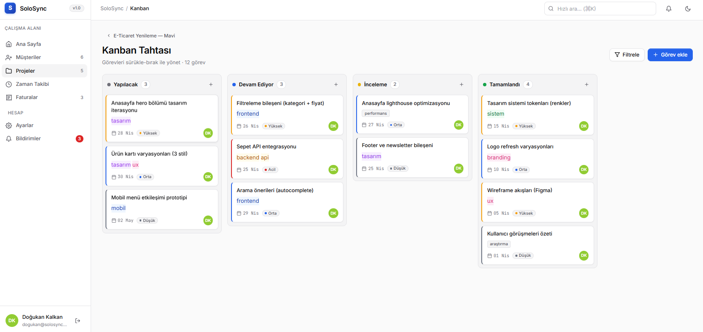
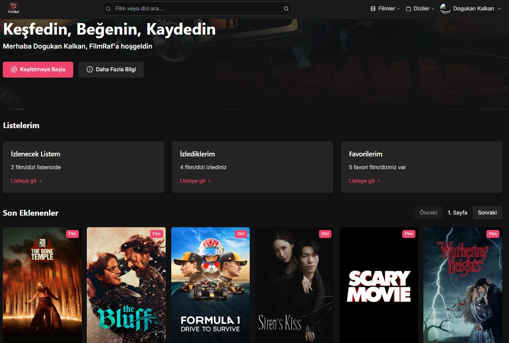
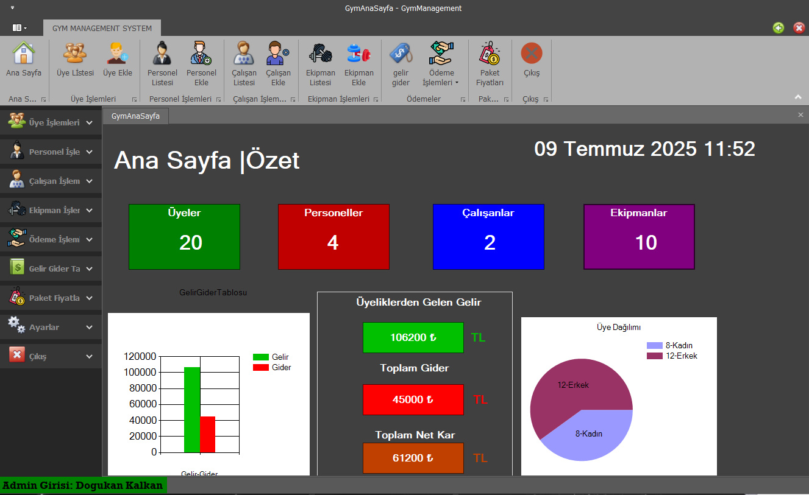

## Merhaba👋, Ben Doğukan!

Ben bir yazılım tutkunuyum; projenin ihtiyacına göre Full Stack Web Geliştiricisi 🌐, Mobil Uygulama Geliştiricisi 📱 veya ML meraklısı 🤖 olarak farklı roller üstlenebiliyorum. Yeni teknolojileri keşfetmeyi ve özellikle Node.js ve JavaScript/TypeScript ekosistemlerini kullanarak ölçeklenebilir çözümler üretmeyi seviyorum 💻 🛠️.
 
 

  
### 🧐 Hakkımda Daha Fazlası:

- 🔭 &nbsp; Şu an üzerinde çalıştığım: SoloSync (Freelancer'lar için SaaS platformu)
- 🌱 &nbsp; Öğrenmeye devam ettiklerim: TypeScript ve gelişmiş LLM entegrasyonları.
- 👨🏻‍💻 &nbsp; Projelerim: [Github](https://github.com/Dogukan-klkn?tab=repositories)
- 📫 &nbsp; İletişim: LinkedIn üzerinden bana ulaşabilirsin. [LinkedIn](https://www.linkedin.com/in/dogukan-kalkan-/)

 
### 🔨 Diller ve Araçlar

#### 🎨 Frontend

#### ⚙️ Backend

#### 🗄️ Veritabanı & Cloud

#### 🤖 AI / Machine Learning

#### 📱 Mobile

#### 🛠️ Araçlar & DevOps

 

### 🛠️ My Projects

